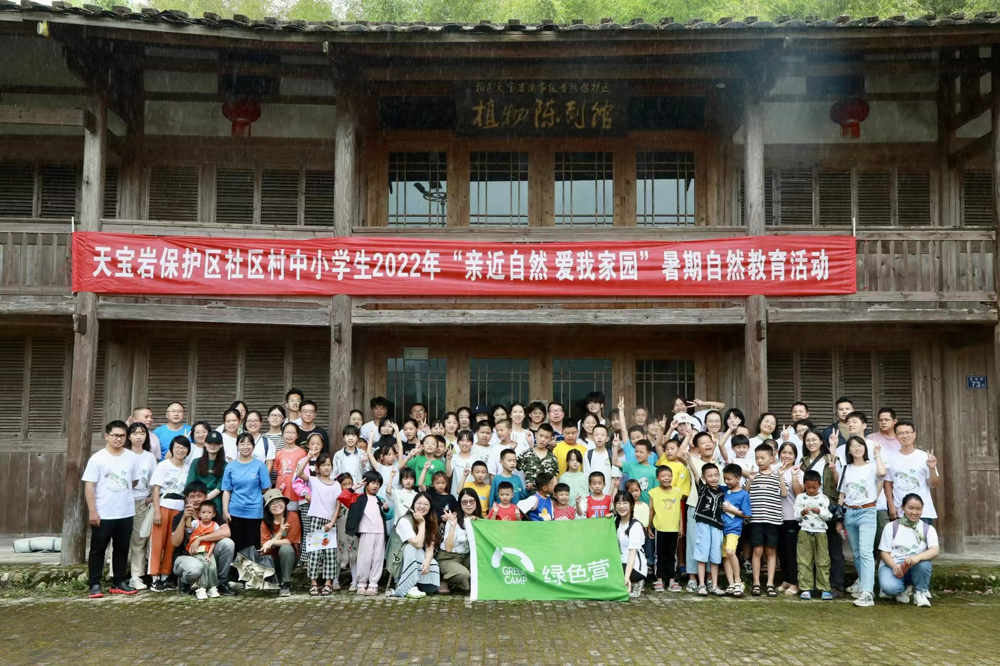
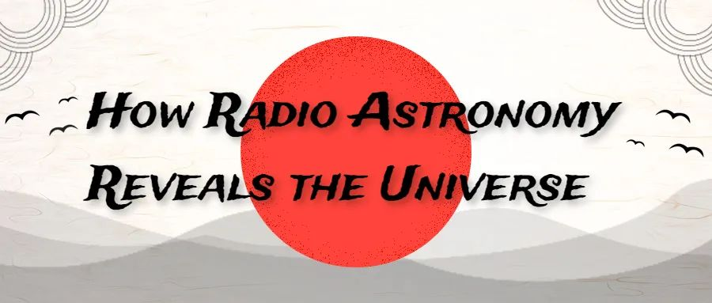
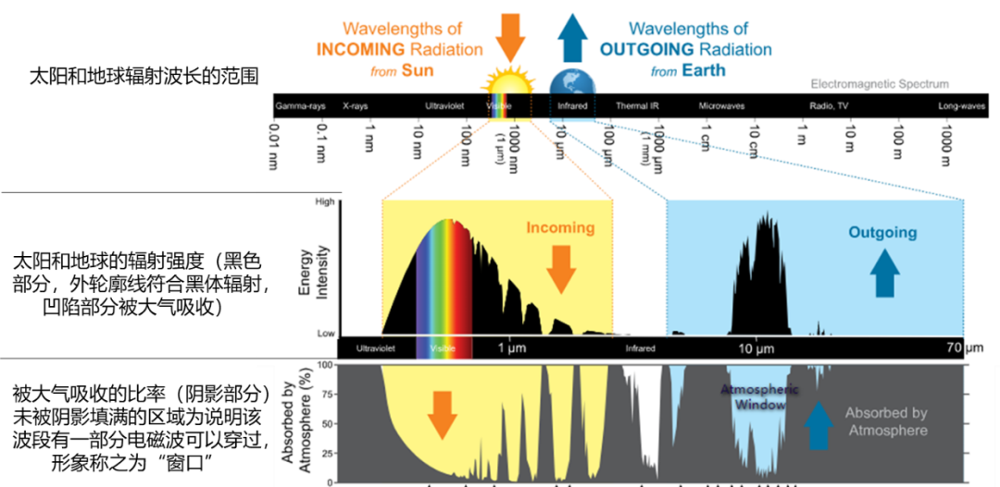

```{r setup, include=FALSE}
knitr::opts_chunk$set(echo = TRUE)
```

## {.tabset}

### Articles

**Green Camp**

{width=30%} 

Daily blogs of the memorable life in the Green Camp

[Day 1](https://mp.weixin.qq.com/s/DrvQ7vL74wHQdw_S0dhzgw) | [Day 2-3](https://mp.weixin.qq.com/s/IIt6jdHti-dT-KT8U3vLRw) | [Day 4-5](https://mp.weixin.qq.com/s/2qOcG9_jjVGU6iaNZ_l8MA)

---

**Phononics|Translation: How radio astronomy reveals the universe**

{width=30%}

[Read the article](https://mp.weixin.qq.com/s/L0Nz9YB2Kl4YbHkse0b1Gg)

---

**Phononics|Reading: The physics and history of global warming**

{width=30%}

[Read the article](https://mp.weixin.qq.com/s/bsTY1GGUYe0onj18CruHJQ)

### Pictures

To be addded

### Vedios

**[Kingfisher](https://www.bilibili.com/video/BV1Ja411n7UX?spm_id_from=333.999.0.0)** photographed at Sustech.

---

