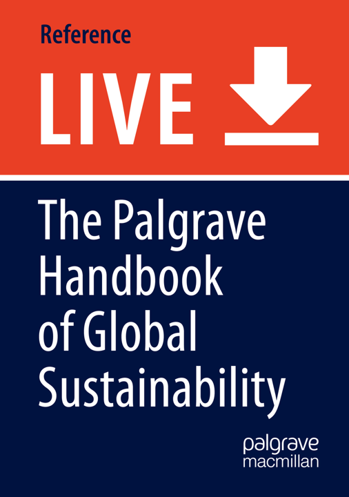

## {.tabset}

### Publications

#### 2022

{width=20%}

[**Liu, Y.**, Zeng, Z. (2022). Wind Energy. In: The Palgrave Handbook of Global Sustainability. Palgrave Macmillan, Cham. https://doi.org/10.1007/978-3-030-38948-2_17-1](https://link.springer.com/referenceworkentry/10.1007/978-3-030-38948-2_17-1)

#### 2021

[Zhou, L., Zeng, Z., Azorin-Molina, C., **Liu, Y.**, Wu, J., Wang, D., Li, D., Ziegler, A. D., & Dong, L. (2021). A Continuous Decline of Global Seasonal Wind Speed Range over Land since 1980, Journal of Climate, 34(23), 9443-9461.](https://journals.ametsoc.org/view/journals/clim/34/23/JCLI-D-21-0112.1.xml)

[Fan, W., **Liu, Y.**, Chappell, A., Dong, L., Xu, R., Ekström, M., Fu, T., & Zeng, Z. (2021). Evaluation of global reanalysis land surface wind speed trends to support wind energy development using In Situ observations, J. Appl. Meteorol. Clim. 60, 1, 33-50.](https://journals.ametsoc.org/view/journals/apme/60/1/jamc-d-20-0037.1.xml)

### Conferences

+ AGU Fall Meeting 2020, eLightning

+ 13th International Conference on Applied Energy, talk

